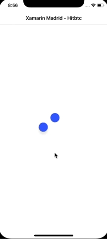

# curso-introduccion-xamarin-forms-2018-XamarinMadrid
material usado en la formación del día 20 de octubre 2018

<h1>Mi primera app con Xamarin Forms usando MVVM</h1>

La idea de está aplicación, es introducir al usuario al mundo de Xamarin Forms aplicando algunas buenas practicas.

<h3>Vamos aprender los siguientes temas con está aplicación:</h3>

<ul>

<li>Uso de MVVM </li>
<li>Navegación respectando los principios básicos de MVVM</li>
<li>Uso de Dependencyservice</li>
<li>Converters</li>
<li>Listview</li>
<li>Llamadas a servicio</li>
<li>Uso de newtonjson</li>
<li>Uso de componente de terceros </li>
<li>Uso de plugins para verificar la conexión.</li>
<li>Crear un dialogo nativo en IOS y Android</li>

</ul>

La navegación está basada en la versión de este libro: <a target="_blank" href="https://www.microsoft.com/net/download/thank-you/xamarin-ebook"> https://www.microsoft.com/net/download/thank-you/xamarin-ebook </a>.Pero con algunas mejoras sobre todo en los ciclos de vida de la página desde el viewmodel. 

